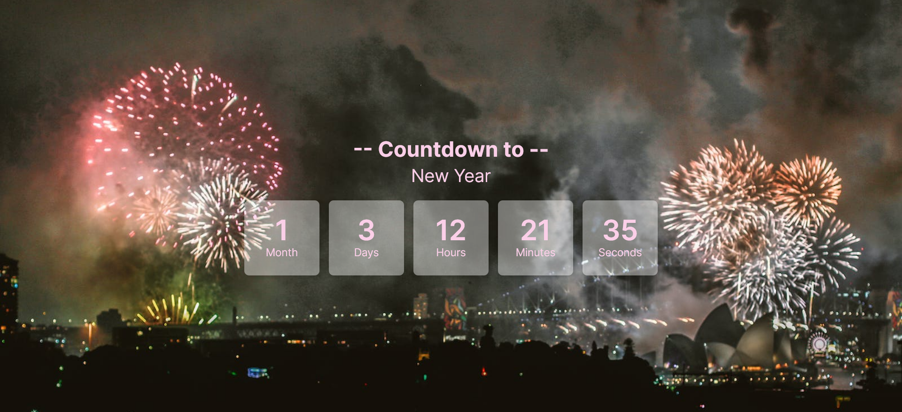

# 🎉 New Year Countdown Timer 🎊

Welcome to the **New Year Countdown Timer** - your fun and friendly way to count down the seconds, minutes, hours, days, and even months to the New Year! 🥳

## About This Project 🌟

As the clock winds down and the anticipation builds, what better way to get in the spirit than with a countdown timer? My timer isn't just any timer - it's a party in an app! 🎈 Packed with cheerful animations and a lively interface, it's the perfect companion to your New Year's Eve preparations.

## Features ⏰

- **Dynamic Countdown**: Counts down to the New Year in months, days, hours, minutes, and seconds.
- **Fun Animations**: Watch as the seconds 'tear away' with a unique animation as each minute passes.
- **Responsive Design**: Looks great on devices of all sizes, from your smartphone to your desktop.
- **Accessibility Focused**: Built with accessibility in mind so that everyone can join the countdown fun!

## Getting Started 🚀

To get the party started with my countdown timer, follow these steps:

1. Clone this repository to your local machine.
2. Navigate to the project directory.
3. Run `npm install` to install all the necessary dependencies.
4. Once the dependencies are installed, run `npm start` to launch the app.
5. Voilà! Start the countdown and let the excitement begin!

## Contributing 🤝

Got ideas on how to make this countdown timer even more fabulous? Contributions are more than welcome! If you'd like to contribute, feel free to fork this repo and submit a pull request. Let's make this countdown the best one yet!

## License 📜

This project is licensed under the [MIT License](LICENSE) - because the best things in life are free (like countdowns to the New Year!).

## Let's Count Down Together! 🎇

Thank you for checking out my New Year Countdown Timer. I can't wait to count down to the New Year with you. Let the good times roll!

